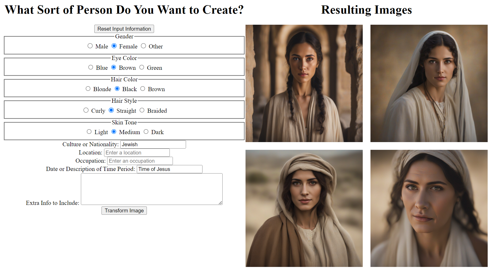
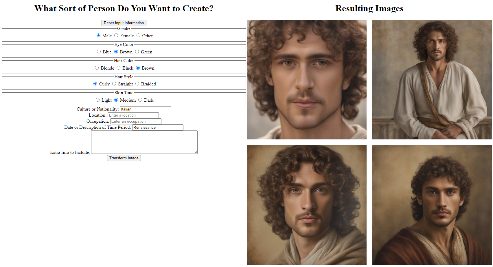
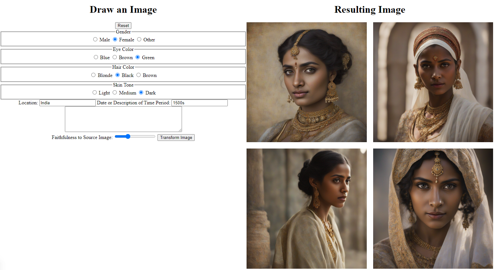
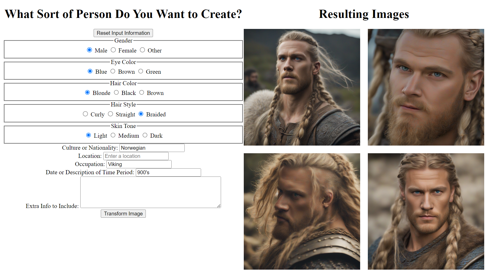
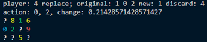
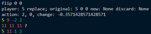

# Personal Projects
By Grant Lewis

This repo is meant to be a location to show-case some personal projects that I have worked on (some of which I am unable to make public currently).

### About Me:
I am a master's student at Brigham Young University studying Computer Science.  My anticipated graduation is in April 2024.  Over the course of my college career I have had several opportunities to work on real-world problems and research.  This includes work as a Graduate Research Assistant focused on researching Large Language Models (LLMs) and how to differentiate them from human written text.  I also have spent over one year as an Associate Data Scientist working on the data science team for Storied.com helping process and digitize millions of records for accurate and effective searching. 

### 89.1% Accuracy at Detecting ChatGPT 

As part of my graduate research, I developed a method to differentiate between text generated by an LLM and text written by a human.  Part of this research involved training a Bayesian Neural Network to differentiate between the different texts.  To do this, I developed a sliding window approach which to look at tokens from an input text.  Each timestep was passed into the network to determine the probability text was generated by an LLM. The model was trained on 2,118 texts generated by an LLM and 1,494 human written texts, each with at least 150 tokens or more (about 900 words).  The Bayesian Neural Network was trained on a sliding window size of 30 for 10 epochs using Standard Variational Inference (SVI) to obtain the loss.  In testing, the model was able to achieve 89.1% accuracy overall.  Further, whenever the model predicted that a human wrote the text, it was correct 99.2% of the time, as shown in the confusion matrix. 

<!--  -->

Because a sliding window approach was used, I could also produce a plot to show what prediction the model makes at each timestep, given the input window.  The first two are examples of text generated by an LLM.  The second two are examples of human written text.

#### LLM Generated Examples:

#### Human Written Examples:

#### Table Descriptions:
**Red Lines:** Signify the average position of a token in the sentence, based on the outputs from the 6 text generation models. Text generated by ChatGPT often looks like the first graph, with large, flat sections. **Flat Blue Lines:** Signify the overall mean when taking all the mean predictions into account. **Blue Lines:** Signify the mean prediction of the model, given an input size of 30 nearby tokens. **Blue Area:** Signifies the standard deviation of the prediction, given the 30 nearby tokens. Note: in the graphs, a label of 1 means text was written by a human and a label of 0 means the text was generated by an AI. 

### Ancestor Avatar Generation

Image generation has improved dramatically with the advent of diffusion models.  One such use-case is to generate images of people, or avatars for ancestors who do not have this information readily available.  My intention was to develop a simple interface where people could provide some basic information and generate an image for a user.

<!-- Jew -->

<!-- Italian -->

<!-- Indian -->

<!-- Swiss -->

<!-- Viking -->

### Skyjo Game Bot

When I learned to play Skyjo ([game description](https://www.geekyhobbies.com/skyjo-card-game-review/)), a card game where you try to get the lowest score, I was convinced there was some skill involved in playing the game.  In other words, I was convinced it wasn't all up to chance.  So I set out to build a Reinforcement Learning (RL) model which would learn to play the game.  I was able to set up the environment, game mechanics, and agent (the RL model) fairly easily.  However, it has been a lot harder to train the model to concistently get a low score.  I have tried several different methods of training the agent and have tried many variations of rewards.  As it stands, it appears that the game is mainly up to chance, based on the random scores that models seem to get.  This project is still ongoing, but I am confident that I will have positive results soon.

#### Example Outputs:

